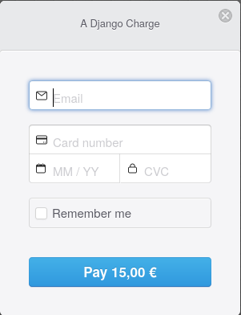

# Code Institute - Final Project

Final Project for Code Institute


a

## Summary

It is hard to keep track of bug reports and new feature suggestions when you are working on few projects
at the same time and have to prioritize one task over another. The purpose of this project website is to make
it easy to keep track of both bugs and features of all your projects and also to prioritize these tasks
that your users/clients are the most interested into.


## Prerequisites

What things you need to install/create before running this software:

```
- Python 3.6 or newer
- PostgreSQL database
- Stripe account
- Environment variables
```

#### *Python 3.6 installation*

Open terminal/command line and type:
```
python --version
``` 
or 
```
python3 --version
``` 
if you can see e.g. `Python 3.6.10`
or newer version you can skip to the next step.

If you see errors you need to install Python 3.6 or newer version on your computer.
Go to the official [Python website](https://www.python.org/downloads/)
and follow the installation instructions for your system.

#### *PostgreSQL installation*

Open terminal/command line and type 
```
postgres --version
``` 
if you can see e.g. `postgres (PostgreSQL) 10.13`
or newer version you can skip to the next step.

If you see errors you need to install newer version of PostgreSQL on your computer.
Go to the official [PostgreSQL website](https://www.postgresql.org/download/)
and follow the installation instructions for your system.

If you are not familiar with PostgreSQL read documentation how to: 
[create user](https://www.postgresql.org/docs/10/sql-createuser.html),
[create database](https://www.postgresql.org/docs/10/sql-createdatabase.html),
[run postresql server](https://www.postgresql.org/docs/10/server-start.html)
or just google how to do above things on your system.
Your PostgreSQL database and user parameters should be the same as in the `DATABASES` section
in the `/Code-Institute---Final-Project/issue_tracker/settings.py` file.

#### *Stripe account creation*

Create [Stripe account](https://dashboard.stripe.com/register)
to be able to do donations.

#### *Environment variables creation*

You need to create 3 environment variables on your system:
```
1) SECRET_KEY -> Django SECRET_KEY that is created automaticaly with each new Django project.
2) STRIPE_SECRET_KEY -> Go to your stripe account you created. Open Developers/API keys tab.
                        Copy the Secret key value.
3) STRIPE_PUBLISHABLE_KEY -> Go to your stripe account you created. Open Developers/API keys tab.
                             Copy the Publishable key value.
```
You can find out how to create environment variables on your system in 
[this article](https://www.schrodinger.com/kb/1842).

## Installing

A step by step series of examples that tell you how to get a development env running

Clone the repository:
```
git clone https://github.com/AnestIwata/Code-Institute---Final-Project
```

Create virtual env:

```
virtualenv env
```

Activate env:
(This will be different for non windows OS)
```
.\env\Scripts\activate.bat
```
Install dependencies:

```
pip install -r requirements.txt
```

Run PostgreSQL database using psql:
```
psql
```

## Deployment

### Deployment on localhost

To run the project on localhost make sure you did all the Prerequisites and Installing steps.
Go to the project directory and type these commands:

```
python manage.py makemigrations
python manage.py migrate
python manage.py runserver
```
If you see any errors after first or second command - check your PostgreSQL settings
(especially if PostgreSQL is running and if database name, password and user are the same
as in the `DATABASES` section
in the `/Code-Institute---Final-Project/issue_tracker/settings.py` file).

Open your browser and go to this address: `http://127.0.0.1:8000/`

### Deployment on heroku

To deploy project on heroku you need to do few things:
```
1. Create heroku account
2. Choose project name
3. Install heroku on your system
4. Set environment variables on heroku
5. Push the project to your heroku
```
#### 1. Create heroku account

Simply create heroku account [here](https://signup.heroku.com/)

#### 2. Choose project name

Login to your [heroku account](https://id.heroku.com/login) 
and create [new project](https://dashboard.heroku.com/apps).

#### 3. Install heroku on your system

Follow installation steps for your system from 
[heroku site](https://devcenter.heroku.com/articles/heroku-cli#download-and-install).

#### 4. Set environment variables on heroku

Open command line terminal and login to your heroku:

```
heroku login
```

Set your remote heroku project:

```
heroku git:remote -a your_project_name_here
```

Set environment variables on heroku:

```
heroku config:set SECRET_KEY=your_django_secret_key_here
heroku config:set STRIPE_PUBLISHABLE_KEY=your_stripe_publishable_key_here
heroku config:set STRIPE_SECRET_KEY=your_stripe_secret_key_here
```

#### 5. Push the project to your heroku

```
git push heroku master
```

You will find the project at:
 
```
https://your_project_name_here.herokuapp.com/
```

## Testing

The project was tested on Windows and Linux system. 

You can test this project manually yourself on [Heroku](https://django-final-project-codeinst.herokuapp.com/).

### Important notes

#### Donations

For the testing purposes there is no real donation payment happening in the project. 
Donations use Stripe testing pair of keys. 
If you use one of the Stripe testing [card numbers](https://stripe.com/docs/testing) your donation 
will be visible in my Stripe account in the testing payments data section.

To make donation you have to type:



`valid email adress` -> there will be no email confirmation sent to this email because the Stripe 
 is on

`valid card number` -> e.g. 4242 4242 4242 4242 or any other Stripe testing [card number](https://stripe.com/docs/testing).
You can also use any other valid card number found via google search. In that case Stripe will return error which is handled
in the code and donation payment is counted but there will be no data about your donation in my Stripe account.

`any future date` 

`any 3 digit number`

*To make real donation payments you have to activate your Stripe account and use pair of stripe keys for real payments.
Also you should handle Stripe data error in the code in more suitable way.

#### Upvoting

For the testing purposes a user can upvote project, bug and feature many times instead of just one time.
Lists of projects, bugs and features are sorted by the number of upvotes they were given so that way it is easier
to see this in action.

## Built With

* [Django](https://www.djangoproject.com/) - The web framework used
* [Heroku](https://www.heroku.com/) - Deployment platform
* [Sentry](https://sentry.io/welcome/) - Used to capture errors

## Acknowledgments

Used free Bootstrap template 
- [Boostrap Business Frontpage](https://startbootstrap.com/templates/business-frontpage/)
- [Django Login/Registration tutorial](https://wsvincent.com/django-user-authentication-tutorial-login-and-logout/)
- [Django Docs](https://www.djangoproject.com/start/overview/)
- [Django Stripe Tutorial](https://testdriven.io/blog/django-stripe-tutorial/)